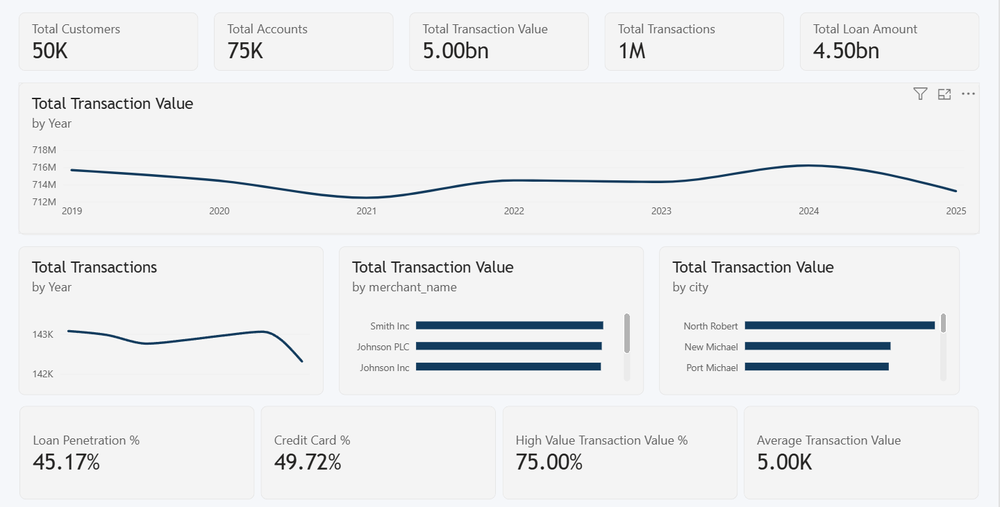
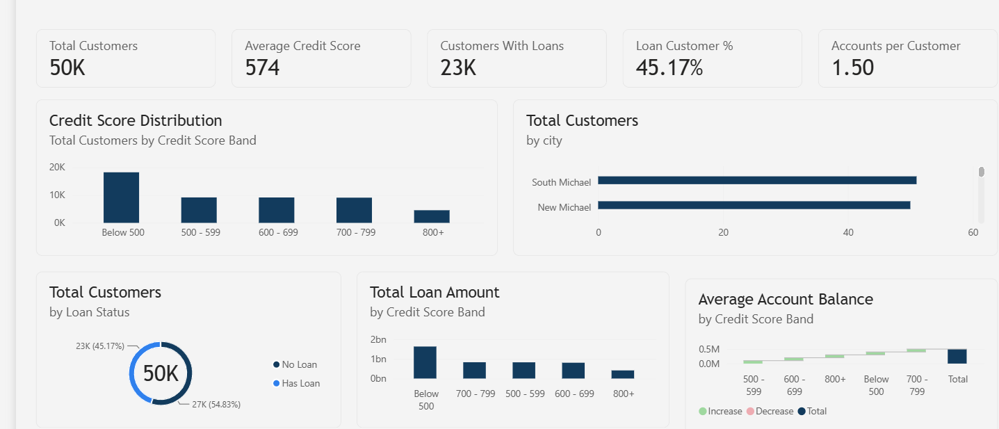
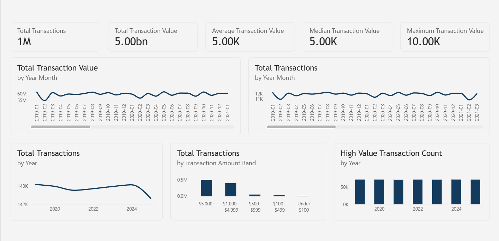
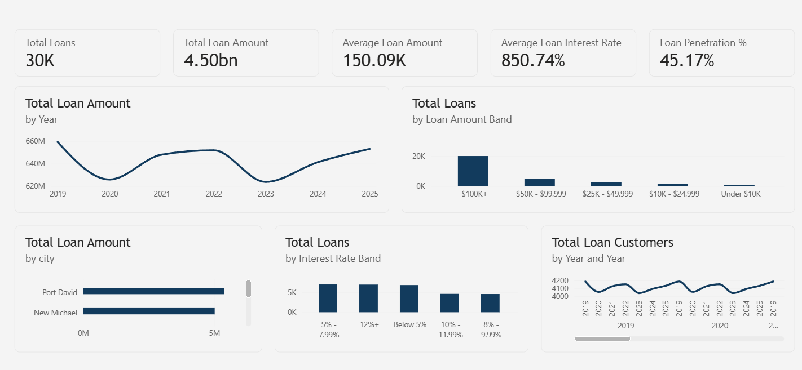

# Banking & Financial Analytics Dashboard

A comprehensive **Banking & Financial Analytics Dashboard** built using **Microsoft Power BI** to analyze customer behavior, transaction activity, lending performance, credit risk indicators, and merchant/geographic performance.

This project transforms a large synthetic banking dataset into an interactive Business Intelligence solution containing six analytical dashboards designed to provide meaningful business insights and support data-driven decision-making.

---

## Project Overview

The objective of this project is to analyze a banking ecosystem across multiple dimensions:

- Customer demographics and financial profiles
- Customer credit scores
- Accounts and account balances
- Debit and credit card distribution
- Transaction volume and transaction value
- High-value transaction activity
- Loan portfolio performance
- Loan amounts and interest rates
- Risk indicators
- Merchant performance
- Geographic transaction activity

The dashboard combines **Power Query, data modeling, DAX, and Power BI visualizations** to turn raw banking data into actionable insights.

---

# Dashboard Pages

The Power BI report contains six analytical dashboards.

## 1. Executive Overview

The Executive Overview provides a high-level summary of the banking ecosystem.

### Key KPIs

- Total Customers
- Total Accounts
- Total Transaction Value
- Total Transactions
- Average Transaction Value

### Key Analysis

- Transaction value over time
- Transaction volume over time
- Top merchants by transaction value
- Transaction activity by city
- Loan penetration
- Credit card share
- High-value transaction contribution

### Dashboard Preview

---

## 2. Customer Analytics

The Customer Analytics dashboard focuses on customer demographics, credit profiles, loan participation, and account relationships.

### Key KPIs

- Total Customers
- Average Credit Score
- Customers With Loans
- Loan Customer %
- Accounts per Customer

### Key Analysis

- Customer distribution by credit score
- Customer distribution by city
- Customers with and without loans
- Loan exposure across credit-score segments
- Account balance across credit-score segments

### Dashboard Preview

---

## 3. Transaction Analytics

The Transaction Analytics dashboard analyzes transaction volume, transaction value, transaction sizes, and high-value activity.

### Key KPIs

- Total Transactions
- Total Transaction Value
- Average Transaction Value
- Median Transaction Value
- Maximum Transaction Value

### Key Analysis

- Transaction value over time
- Transaction volume over time
- Average transaction value over time
- Transaction amount distribution
- High-value transaction activity

### Dashboard Preview

---

## 4. Loans & Credit Analysis

The Loans & Credit Analysis dashboard focuses on the bank's lending portfolio and credit-related metrics.

### Key KPIs

- Total Loans
- Total Loan Amount
- Average Loan Amount
- Average Interest Rate
- Loan Penetration %

### Key Analysis

- Loan amount over time
- Loan distribution by loan amount
- Loan exposure by city
- Loan distribution by interest-rate segment
- Loan customers over time

### Dashboard Preview

---

